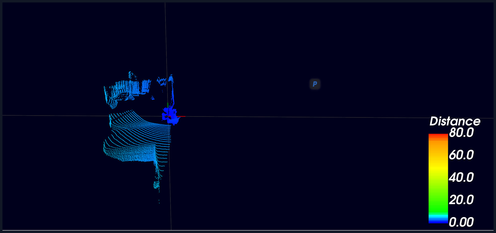

# OW1 激光雷达开源资料

本仓库用于整理 OW1 激光雷达相关资料，主要包括配置软件、点云上位机、SDK/ROS 驱动资源、产品文档以及三维结构模型。

## 点云显示效果

<p align="center">
  
</p>

<p align="center">
  <sub>OW1 激光雷达在 LidarView v2.0.6 中的点云显示效果：点云按距离进行伪彩色渲染，可用于验证雷达点云输出、上位机显示与现场调试效果。</sub>
</p>

## 仓库结构

```text
SimanOW1/
├── assets/
│   └── ow1-lidarview-pointcloud.png # README 点云显示效果图
├── 3DModel/
│   ├── OW1.SLDPRT                  # SolidWorks 原始三维模型
│   └── OW1.stp                     # STEP 通用三维模型，便于机械结构集成
├── sdk/
│   └── lidar_view.zip              # SDK、ROS/ROS2 驱动、示例和接口文档
├── softs/
│   ├── LidarCommunicator_v1.0.9.zip # 雷达参数配置/通信工具
│   └── LidarView v2.0.6.zip         # Windows 点云查看上位机
├── OW1.pdf                         # OW1 产品说明/资料文档
└── readme.md                       # 项目说明
```

## 模块说明

### 1. 配置软件

`softs/LidarCommunicator_v1.0.9.zip` 是雷达参数配置与通信工具，适合用于设备网络参数、配置参数、模板参数文件等调试场景。压缩包内包含可执行程序、默认参数文件、参数模板表以及 Qt 运行依赖。

**其中 `Tanway_Lidar_Parameter360_template原C整机.xlsx` 为雷达出厂配置 Excel 表，位于配置工具压缩包内，可用于记录和维护整机出厂参数、标定参数、补偿值以及后续参数修改模板。**

典型用途：

- 连接和验证雷达通信状态；
- 读取、写入或比对设备参数；
- 修改设备 IP、端口等网络通信配置；
- 配合参数模板进行出厂、调试或现场配置。

### 2. 点云上位机

`softs/LidarView v2.0.6.zip` 是 Windows 平台点云查看上位机，主要用于实时接收雷达 UDP 数据并显示三维点云。压缩包中包含 `LidarView.exe`、点云解析库、算法库、Qt/PCL/VTK 相关运行库以及配置文件。

典型用途：

- 实时查看 OW1 激光雷达点云；
- 加载和验证雷达配置；
- 辅助现场安装、调试和问题定位；
- 配合 WinPcap/Wireshark 相关组件进行网络数据分析。

### 3. SDK 与 ROS/ROS2 驱动

`sdk/lidar_view.zip` 包含激光雷达 SDK、ROS/ROS2 节点、启动文件、消息定义、RViz 配置和接口文档。该部分适合二次开发者集成点云解析能力，或在机器人系统中通过 ROS/ROS2 使用 OW1 雷达。

解压后的主要结构如下：

```text
lidar_view/
├── CMakeLists.txt                  # ROS/ROS2 构建入口
├── launch/
│   ├── OW1.launch                  # ROS1 启动配置
│   └── lidar.py                    # ROS2 启动配置
├── msg/                            # ROS 消息定义
├── rviz/                           # RViz 显示配置
├── src/                            # ROS/ROS2 节点源码
└── sdk/
    ├── config/                     # 雷达和算法 JSON 配置
    ├── demo/                       # SDK 使用示例
    ├── doc/                        # 参数、接口、状态码、点云解算说明
    ├── include/                    # SDK 对外接口和数据结构
    ├── lib/                        # 预编译算法库
    ├── lidar/                      # 雷达设备管理与点云解析实现
    ├── log/                        # 日志模块
    └── utils/                      # 工具函数
```

SDK 主要能力：

- 支持在线连接雷达和离线回放 PCAP 数据；
- 解析激光雷达原始 UDP 数据；
- 输出三维点云坐标、强度、时间戳等信息；
- 支持 ROS1/ROS2 集成和 RViz 可视化；
- 支持 Windows、Ubuntu x86_64 以及 aarch64 平台相关开发。

常用默认网络参数：

```text
雷达 IP：192.168.111.51
上位机 IP：192.168.111.204
点云数据端口：5600
DIF/设备信息端口：5700
```

### 4. 三维模型

`3DModel/` 目录提供 OW1 激光雷达的机械结构模型：

- `OW1.SLDPRT`：SolidWorks 原始零件文件，适合继续编辑；
- `OW1.stp`：通用 STEP 文件，适合导入 CAD、结构设计、仿真和装配软件。

典型用途：

- 机器人、车辆、支架等安装结构设计；
- 设备外形空间占位检查；
- 机械接口评估；
- 三维展示或产品资料制作。

### 5. 产品文档

`OW1.pdf` 为 OW1 激光雷达相关产品资料，可作为用户理解设备参数、接口、安装方式和使用流程的参考文档。

## 快速使用

1. 查看产品资料：打开 `OW1.pdf`，确认设备参数、安装方式和接口说明。
2. 配置设备参数：解压 `softs/LidarCommunicator_v1.0.9.zip`，运行其中的配置工具。
3. 查看实时点云：解压 `softs/LidarView v2.0.6.zip`，运行 `LidarView.exe`。
4. 进行二次开发：解压 `sdk/lidar_view.zip`，根据内部 README 编译 ROS/ROS2 驱动或 SDK 示例。
5. 做机械集成：使用 `3DModel/OW1.stp` 或 `3DModel/OW1.SLDPRT` 导入结构设计软件。

## 仓库内容范围

本仓库包含以下内容：

- OW1 激光雷达配置工具；
- OW1 点云查看上位机；
- SDK、ROS/ROS2 驱动与示例代码；
- 设备参数和接口说明文档；
- OW1 三维模型文件。

## 后续 To Do

后续计划继续补充雷达配置初始化与具体参数修改相关内容，主要包括：

- 雷达出厂或首次使用时的配置初始化流程；
- 雷达网络参数、工作模式、数据端口等基础配置修改说明；
- 雷达内参补偿值、外参补偿值的读取、修改和写入方法；
- 偏置角度、安装角度、坐标系补偿等参数的配置说明；
- 出厂标定参数、标定文件和版本信息的管理方式；
- `Tanway_Lidar_Parameter360_template原C整机.xlsx` 出厂配置表的字段说明、填写规范和参数导入导出流程；
- 参数修改后的验证流程，包括点云显示、通信状态和标定效果检查。
